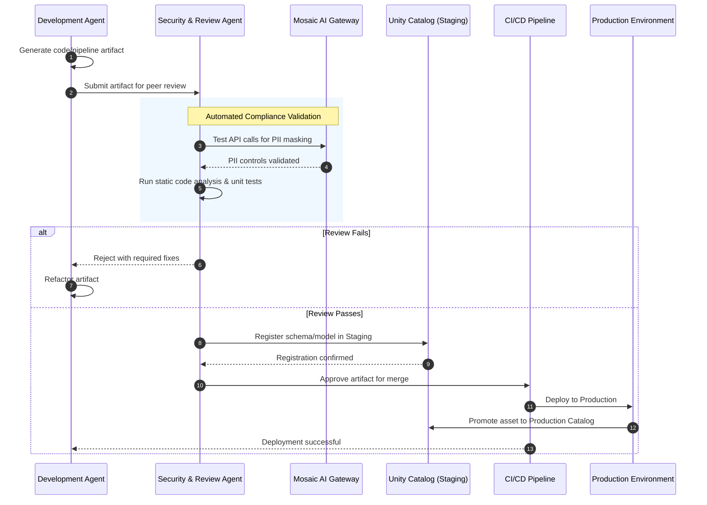

# Autonomous Agent Artifact Review Workflow

## Diagram

## Participant Overview

| Participant | Role |
|-------------|------|
| **Development Agent** | Autonomous agent responsible for generating code, pipeline definitions, or ML model artifacts |
| **Security & Review Agent** | Peer-review agent that performs compliance validation, static analysis, and unit testing before approving promotion |
| **Mosaic AI Gateway** | PII masking and API governance layer; validates that all outbound LLM calls are properly redacted |
| **Unity Catalog (Staging)** | Staging environment within Unity Catalog where schemas and models are registered before production promotion |
| **CI/CD Pipeline** | Automated pipeline that executes deployment upon review approval |
| **Production Environment** | Live compute and serving infrastructure receiving promoted artifacts |

## Workflow Steps

| Step | Description |
|------|-------------|
| 1 | Development Agent generates the artifact (code, pipeline, or model) |
| 2 | Artifact is submitted to the Security & Review Agent for peer review |
| 3 | Security Agent tests API calls through Mosaic AI Gateway to verify PII masking is active |
| 4 | Gateway confirms PII controls are validated |
| 5 | Security Agent runs static code analysis and unit tests locally |
| **Fail path** | Security Agent rejects the artifact with required fixes; Development Agent refactors and resubmits |
| 6 | On pass: schema or model is registered in Unity Catalog (Staging) |
| 7 | Unity Catalog confirms staging registration |
| 8 | Security Agent approves artifact for merge into CI/CD |
| 9 | CI/CD Pipeline deploys artifact to Production |
| 10 | Production environment promotes the asset to the Production Catalog in Unity Catalog |
| 11 | CI/CD notifies the Development Agent of successful deployment |

## Key Design Decisions

- **Agent-to-Agent Review** — The Development Agent cannot self-approve; all artifacts must pass an independent Security & Review Agent before promotion.
- **PII Validation at the Gateway** — The review loop explicitly tests that PII masking is functioning on live API calls, not just assumed from configuration.
- **Staging Catalog Registration** — Artifacts are registered in Unity Catalog staging before any production deployment, ensuring governance metadata is captured at the point of approval.
- **Automated Reject-and-Refactor Loop** — Failed reviews return structured feedback to the Development Agent, enabling autonomous remediation without human intervention on routine issues.
- **Immutable Promotion Path** — The only route to Production is through the CI/CD pipeline after Security Agent approval; no direct writes to production are permitted.
