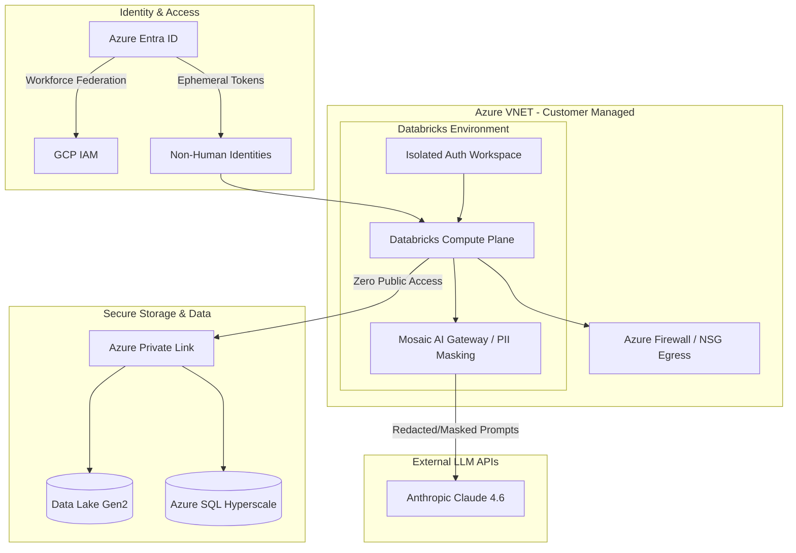

# Analytics Platform Architecture

## System Architecture Diagram

## Component Overview

### Identity & Access
| Component | Role |
|-----------|------|
| **Azure Entra ID** | Central identity provider; federates workforce identities to GCP IAM and issues ephemeral tokens for non-human identities |
| **GCP IAM** | Receives federated workforce credentials for cross-cloud resource access |
| **Non-Human Identities (NHI)** | Short-lived, ephemeral service principals used by automated workloads and pipelines |

### Azure VNET (Customer Managed)
| Component | Role |
|-----------|------|
| **Azure Firewall / NSG Egress** | Controls and inspects all outbound traffic from the compute plane |
| **Isolated Auth Workspace** | Dedicated Databricks workspace handling authentication flows in isolation |
| **Databricks Compute Plane** | Core data processing and ML compute; all external access routed through Private Link or Firewall |
| **Mosaic AI Gateway / PII Masking** | Intercepts LLM-bound prompts to redact/mask PII before forwarding to external APIs |

### Secure Storage & Data
| Component | Role |
|-----------|------|
| **Azure Private Link** | Ensures storage and database traffic never traverses the public internet |
| **Data Lake Gen2** | Primary object store for raw and processed data |
| **Azure SQL Hyperscale** | Scalable relational store for structured analytics data |

### External LLM APIs
| Component | Role |
|-----------|------|
| **Anthropic Claude 4.6** | External LLM; receives only redacted/masked prompts via the Mosaic AI Gateway |

## Security Principles

- **Zero Public Access** — Compute-to-storage traffic is routed exclusively through Azure Private Link.
- **PII Masking at the Gateway** — All prompts are scrubbed before leaving the VNET boundary.
- **Ephemeral Credentials** — Non-human identities use short-lived tokens, minimising credential exposure.
- **Egress Control** — Outbound internet traffic is gated through Azure Firewall / NSG rules.
- **Workforce Federation** — Human identities flow from Entra ID into GCP IAM via federation, avoiding standing cross-cloud credentials.
