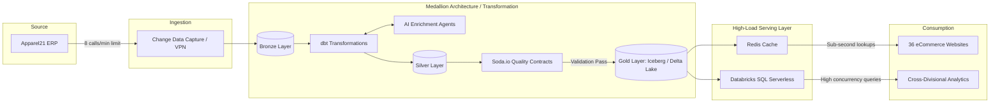

# Data Flow

## Diagram

## Component Overview

### Source
| Component | Role |
|-----------|------|
| **Apparel21 ERP** | Source-of-truth transactional system; exposes data at a rate-limited 8 calls/min API |

### Ingestion
| Component | Role |
|-----------|------|
| **Change Data Capture / VPN** | Captures incremental ERP changes and delivers them securely over VPN into the platform |

### Medallion Architecture / Transformation
| Component | Role |
|-----------|------|
| **Bronze Layer** | Raw, unmodified ingestion target; preserves source fidelity for reprocessing |
| **dbt Transformations** | Declarative SQL transformations that promote data from Bronze to Silver with business logic applied |
| **AI Enrichment Agents** | LLM-powered agents invoked bidirectionally by dbt to enrich, classify, or augment records during transformation |
| **Silver Layer** | Cleaned, conformed, and enriched dataset; source for quality validation |
| **Soda.io Quality Contracts** | Data quality gate; records only advance to Gold on a validation pass |
| **Gold Layer (Iceberg / Delta Lake)** | Curated, query-optimised tables in open table format; single source for all downstream serving |

### High-Load Serving Layer
| Component | Role |
|-----------|------|
| **Databricks SQL Serverless** | Scales automatically for high-concurrency analytical queries |
| **Redis Cache** | In-memory cache fronting eCommerce lookups; delivers sub-second response times |

### Consumption
| Component | Role |
|-----------|------|
| **36 eCommerce Websites** | Customer-facing storefronts reading product, pricing, and inventory data via Redis |
| **Cross-Divisional Analytics** | Internal BI and analytics tools running high-concurrency queries against the SQL Serverless warehouse |

## Key Design Decisions

- **Rate-Limited Ingestion** — The ERP's 8 calls/min cap is respected at the CDC layer, with incremental capture used to maximise throughput within that constraint.
- **Medallion Layering** — Bronze → Silver → Gold progression ensures raw data is always preserved while progressively applying quality and enrichment.
- **AI-in-the-Pipeline** — AI Enrichment Agents integrate bidirectionally with dbt, enabling LLM-assisted classification and augmentation without breaking the transformation DAG.
- **Quality Contracts** — Soda.io acts as a hard gate; no data reaches Gold or downstream consumers without passing defined quality contracts.
- **Dual Serving Paths** — Redis handles latency-sensitive eCommerce reads; Databricks SQL Serverless handles analytical concurrency, keeping both workload types isolated.
