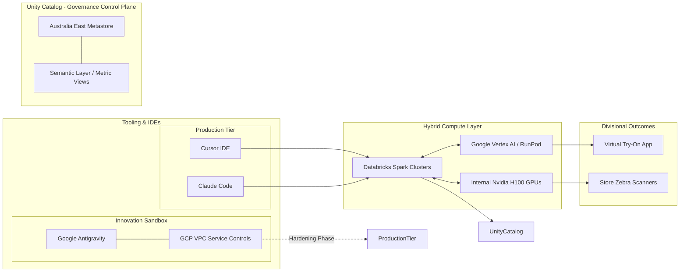

# System Architecture

## Diagram

## Component Overview

### Tooling & IDEs
| Component | Role |
|-----------|------|
| **Cursor IDE** | AI-assisted IDE used by engineers to author and submit jobs to Databricks clusters |
| **Claude Code** | Agentic CLI for code generation and pipeline authoring; targets Databricks compute directly |
| **Google Antigravity** | Experimental GCP-hosted sandbox environment for innovation workloads |
| **GCP VPC Service Controls** | Network perimeter enforcing access boundaries around Antigravity; in hardening phase toward production |

### Unity Catalog — Governance Control Plane
| Component | Role |
|-----------|------|
| **Australia East Metastore** | Regional Unity Catalog metastore; single source of truth for all data assets, lineage, and access policies |
| **Semantic Layer / Metric Views** | Governed metric definitions exposed to downstream tools for consistent cross-divisional reporting |

### Hybrid Compute Layer
| Component | Role |
|-----------|------|
| **Databricks Spark Clusters** | Primary distributed compute for ETL, ML training, and SQL analytics |
| **Internal Nvidia H100 GPUs** | On-premises GPU fleet for latency-sensitive or data-residency-constrained inference workloads |
| **Google Vertex AI / RunPod** | Cloud-based GPU inference for scalable or experimental model serving |

### Divisional Outcomes
| Component | Role |
|-----------|------|
| **Virtual Try-On App** | Customer-facing AR/ML application powered by Vertex AI inference |
| **Store Zebra Scanners** | In-store handheld devices consuming real-time model outputs from on-prem H100 GPUs |

## Key Design Decisions

- **Hybrid Compute** — On-premises H100s handle store-facing, low-latency use cases; cloud GPU services handle scalable consumer-facing workloads.
- **Governance via Unity Catalog** — All data assets, regardless of compute origin, are registered in a single regional metastore with a shared semantic layer.
- **Sandboxed Innovation** — GCP Antigravity is isolated behind VPC Service Controls during the hardening phase before any promotion to the production tier.
- **IDE-to-Cluster Directness** — Both Cursor and Claude Code submit work directly to Databricks clusters, keeping the development feedback loop tight.
